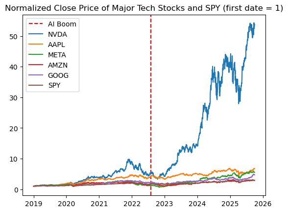
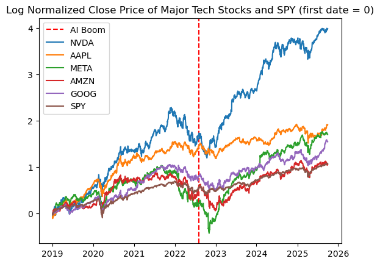
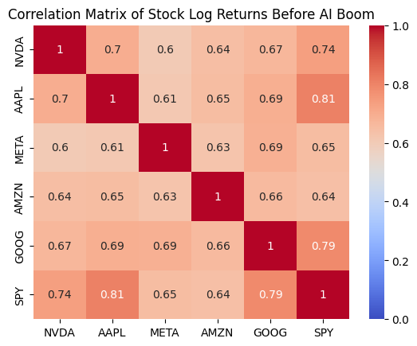
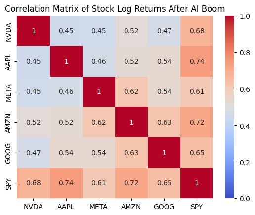
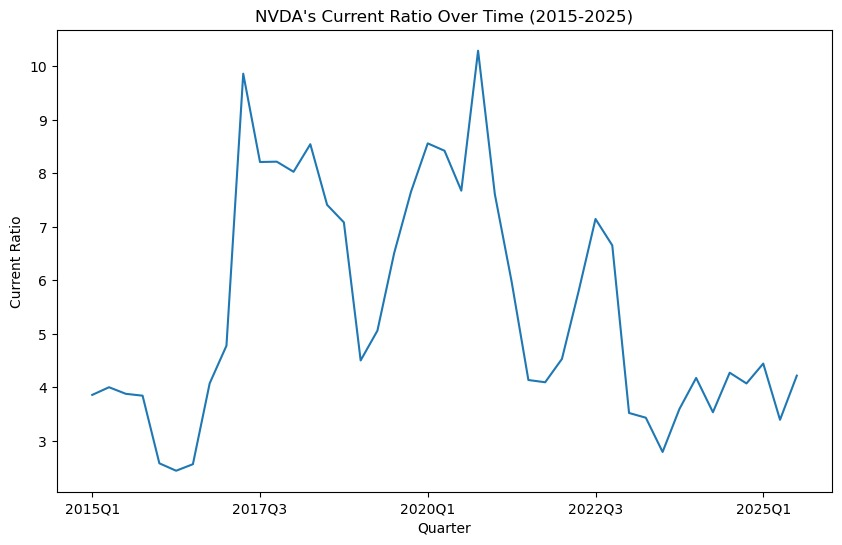
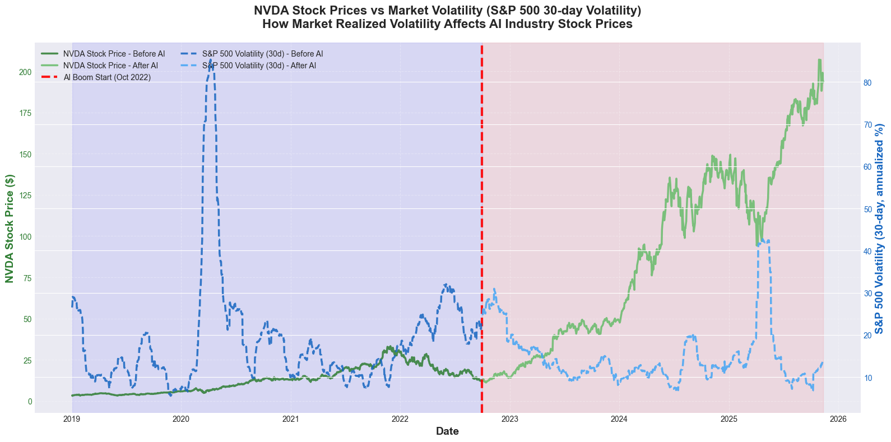
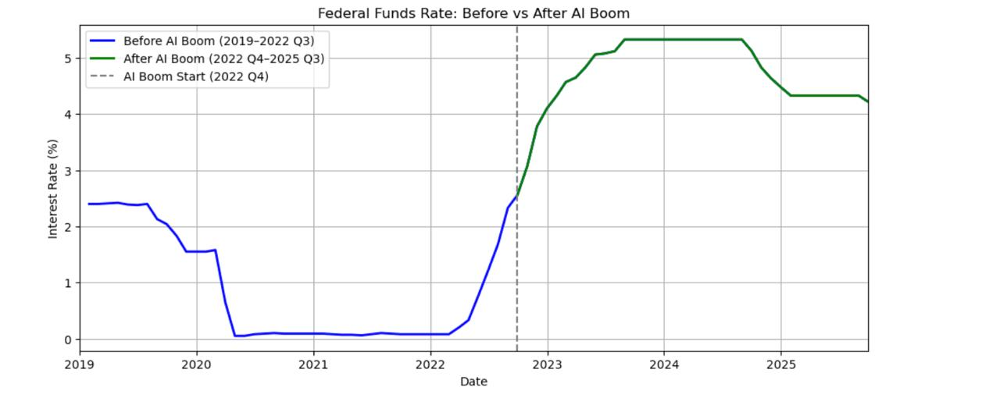
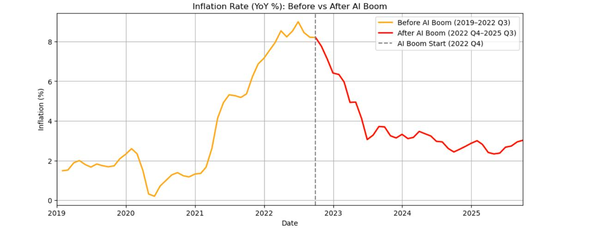
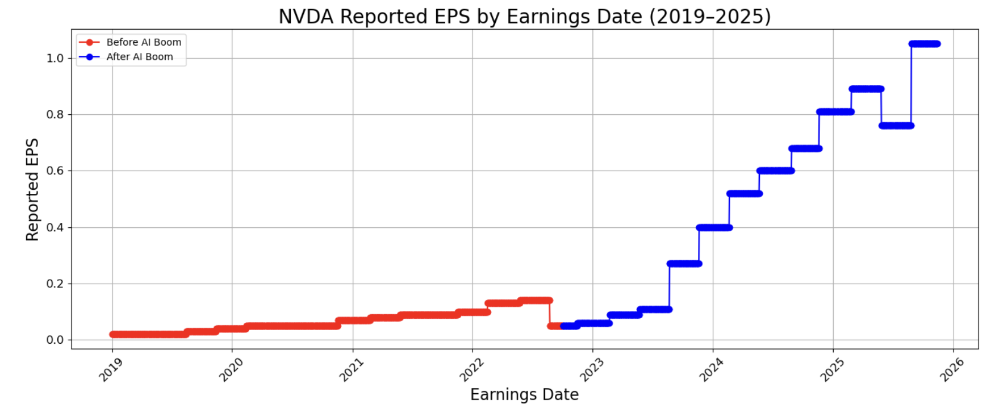
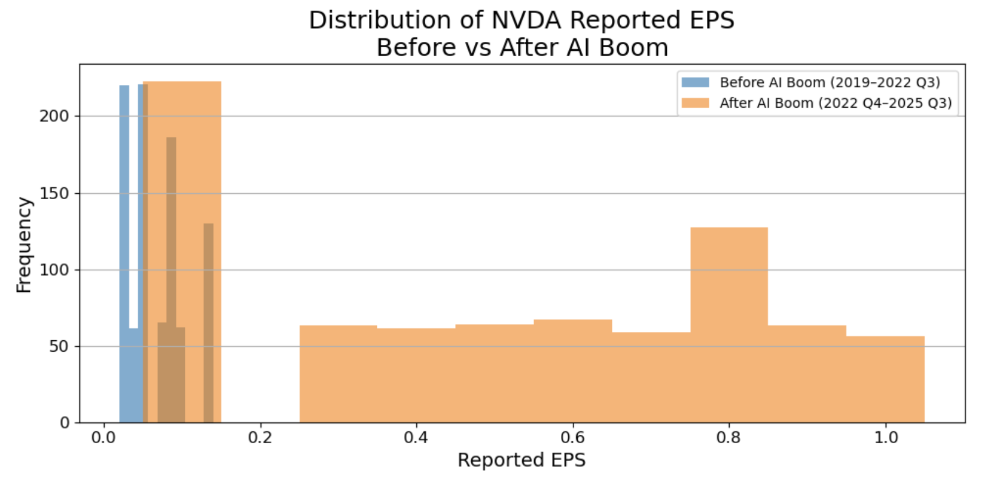

# A Regression Analysis of Stock Price Correlations and Macroeconomic Factors During the AI Boom
[GitHub](https://github.com/vdanielb/stock-market-inference)
## Key Findings

Our analysis reveals a **definitive structural break** in NVIDIA's trading patterns following ChatGPT's release in late 2022:

### Research Question 1: Stock Correlations

- **Before AI Boom**: NVDA showed strong co-movement with major tech stocks (AAPL, AMZN, META, GOOG) and the broader market (SPY), behaving like a typical mega-cap tech stock.

- **After AI Boom**:   
    - NVDA's relationship with **AAPL and AMZN significantly weakened** (p < 0.001), indicating divergence from general tech trends
    - NVDA's relationship with **SPY increased dramatically** (γ = 1.359, p < 0.001), suggesting NVDA transformed from a market component to a market driver
    - Relationships with META and GOOG remained stable

- **Model Performance**: The interaction regression model explains **54.4%** of variation in NVDA's daily returns (R² = 0.544)

### Research Question 2: Macroeconomic Factors

- **Before AI Boom**: NVDA behaved like a traditional high-growth tech stock, sensitive to market volatility (VIX), interest rates, and liquidity conditions.

- **After AI Boom**:
    - **Earnings sensitivity increased dramatically**: ΔEPS coefficient jumped from 0.412 to 1.696 (baseline + interaction), making earnings the strongest predictor
    - **Liquidity sensitivity increased**: M2 growth coefficient increased from 0.138 to 0.440, indicating NVDA became a major beneficiary of capital inflows
    - **Volatility and interest rate sensitivity remained stable**: No significant change in VIX or Treasury rate effects

- **Comparison with SPY**: Unlike SPY, which remains anchored to interest rates and inflation, NVDA now reacts primarily to its own earnings and liquidity flows, behaving as a distinct earnings engine rather than following traditional economic factors.

- **Model Performance**: The macroeconomic model explains **48.2%** of variation in NVDA's daily returns (R² = 0.482)

---

## 1. Introduction

### 1.1 Research Questions

**Research Question 1:** How does NVIDIA's stock returns correlate with other major technology companies (META, AMZN, AAPL, GOOG) and the S&P 500 (SPY), and how has this relationship changed before and after the AI boom?

**Research Question 2:** To what extent are NVDA's stock returns explained by changes in earnings, market volatility, inflation, interest rates, and liquidity before and after the AI boom? How does it differ from SPY?

### 1.2 AI Boom Definition

We define the AI boom as the period when ChatGPT was released, that is **November 2022 or 2022 Q4**. As a result, we gather data from:
- **Before AI boom**: 2019 Q1 to 2022 Q3
- **After AI boom**: 2022 Q4 to 2025 Q3

---

## 2. Methodology

### 2.1 Relevant Variables

#### Research Question 1:

- **Stock Prices and Returns of Major Tech Stocks**: NVDA is the dependent variable for our correlation and regression analysis. Historically, NVDA moved closely with the overall tech sector. After the AI boom, we want to see if NVDA diverged sharply from most peers due to the GPU demand explosion. We use returns instead of prices because prices are non-stationary and can rise over time even without meaningful relationships, while returns measure actual percentage changes in value. We also use the natural log of the returns to utilize some of its nice properties. For example, simple returns don't capture compounding changes well. If a stock rises 10% one day but drops 10% the next, the total isn't 0%, but actually -1%. For this case, simple returns would require multiplying, while log would just be additive.

- **S&P 500 Index (SPY ETF)**: Market-wide benchmark which we need to measure NVDA's relationship with overall market risk and compare NVDA's beta before vs after the AI boom.

#### Research Question 2:

- **Inflation and federal interest rates**: Federal Reserve Economic Data (FRED): Inflation and federal interest rates influence stock prices because they shape consumer demand, business costs, and investor choices. Higher inflation reduces purchasing power and raises operating costs, which can lower company profits and make stocks less valuable. Higher interest rates increase borrowing costs, slow spending, and make safer assets like bonds more attractive, pulling money away from stocks. Together, these forces help explain why changes in inflation and interest rates have a significant impact on stock prices and returns.

- **Liquidity ratio (NVDA)**: A measure of a firm's financial health or liquidity (the amount of assets they have compared to the amount of debt they owe) defined as Current Ratio = Current Assets / Current Liabilities. Typically, companies with high liquidity are favored by investors and are therefore theoretically positively correlated with higher stock prices/returns. Data is obtained from annual balance sheets posted by the Securities and Exchange Commissions.

- **Market volatility**: The degree of variation in asset prices over time, often measured as the standard deviation of returns over a given period. When volatility is high, prices tend to move more rapidly and unpredictably; when it is low, markets are generally more stable and price movements are more gradual. Volatility directly affects price movements by altering investor behavior and the risk premium embedded in asset prices. Indirectly, it shapes how strongly stocks co-move with the broader market or with each other, which can influence correlation patterns.

- **NVDA earnings per share (EPS)**: Quarterly NVDA earnings, which quantify NVDA's performance before and after the AI boom. Clearly, a company's profits should correlate positively with its stock price.

### 2.2 Data Collection

- **Yahoo Finance** ([https://finance.yahoo.com](https://finance.yahoo.com)): Historical stock prices for all major stocks. From stock prices, we can calculate returns and log returns ourselves, as well as market volatility. They also have data for earnings (which we use to calculate earnings per share).

- **Federal Reserve Economic Data (FRED)**: 
  - For federal interest rates: [FEDFUNDS dataset](https://fred.stlouisfed.org/graph/fredgraph.csv?id=FEDFUNDS)
  - For inflation rate: [CPIAUCSL dataset](https://fred.stlouisfed.org/graph/fredgraph.csv?cosd=1990-01-01&coed=2040-01-01&id=CPIAUCSL)

- **U.S. Securities and Exchange Commission (SEC)**: Data on annual balance sheets for companies in the U.S. ([SEC EDGAR](https://www.sec.gov/cgi-bin/browse-edgar?action=getcompany&CIK=NVDA&type=10-K&dateb=&owner=exclude&count=100))

### 2.3 Data Pre-Processing

- We use stock close prices per day to calculate the log returns, where log returns = log(P_t/P_{t-1}).
- We then had to transform quarterly and yearly data (inflation, liquidity, EPS) to daily. We did this by forward-filling all the values to daily.
- Finally, we merged all the data into one master dataset, using date as the index.

---

## 3. Exploratory Data Analysis

Exploratory data analysis reveals a clear structural break in NVIDIA's behavior following the AI boom in late 2022. Prior to this period, NVDA's price movements closely tracked those of other major technology stocks and the broader market. After the AI boom, NVDA diverges sharply, coinciding with a significant acceleration in earnings and a decline in market volatility. Correlation analysis shows weakened co-movement with peer firms post-2022, while liquidity remains strong throughout the sample. These patterns motivate the regression framework and the use of interaction terms to formally test changes in relationships before and after the AI boom.

### 3.1 Stock Price Analysis

For the first research question, we do some EDA on prices and returns of each stock we are interested in. First, we investigate how stock prices have changed from 2019 Q1 to 2025 Q3.

As we can see, NVDA's movement more or less followed other major tech companies before the AI boom, but began to greatly diverge after the AI boom.

### 3.2 Correlation Analysis

We can also see the correlation matrix of log returns of each stock before and after the AI boom.

The log returns of NVDA and the other stocks were pretty high before the AI boom. After the AI boom, it seems that the correlation between NVDA and the other stocks decreased, but there's still a moderate positive relationship. This is consistent with our previous graph where NVDA greatly diverged.

### 3.3 Liquidity Analysis

For research question 2, since we are looking at historical data, a time-series plot to understand the overall trend seems to be the most fitting for now.

NVIDIA's liquidity from 2015 to 2025 can be explained by its current ratio (current assets/current liabilities). The bigger, the better. If it's lower than 1, that means the company has more debt than assets.

NVIDIA's current ratio is consistently above 3 for the whole period, rising to unusually high levels around 2017 to 2020 and then declining after 2021. The peak in 2022 indicates increased income for the company due to the AI hype, while the later decline toward the 3 to 4 range reflects increased spending and higher short-term obligations during the AI expansion period. Liquidity helps assess whether NVIDIA's stock price responds to financial stability or to AI-driven growth expectations.

### 3.4 Market Volatility Analysis

The chart shows a clear contrast between NVIDIA's stock behavior before and after the AI boom. Prior to late 2022, market uncertainty was extremely elevated, especially during the COVID-19 period, when S&P 500 volatility surged to unusually high levels. This environment of heightened volatility generally suppresses equity performance because investors demand higher risk compensation and are more likely to sell or avoid volatile assets. In this context, NVDA's stock price remained relatively stagnant despite being a high-growth tech company. After the AI boom began and pandemic-related uncertainty faded, market volatility returned to lower, more stable levels, as reflected by the decline in the S&P's realized volatility.

### 3.5 Macroeconomic Environment

**Inflation and Federal Interest Rates Visualization Before vs After AI Boom**

- The charts show a sharp shift in the macroeconomic environment around the start of the AI boom.
- Interest rates were near zero before 2022 but rose to 4–5% afterward.
- Inflation spiked to around 9% before the AI boom, then declined steadily during the AI period.
- The plots help clarify whether changes in tech stock prices are driven by macroeconomic conditions or by AI-related growth.

### 3.6 Earnings Per Share Analysis

EPS is one of the strongest fundamental indicators of a company's earnings capacity and profitability and is central to valuation because higher EPS means higher intrinsic stock value. This graph shows that NVIDIA's EPS rises slowly before the AI boom but accelerates dramatically afterward, reflecting a structural jump in profitability.

This histogram shows that NVIDIA's EPS values cluster at low levels before the AI boom but shift to a much higher and wider range afterward, revealing a new earnings regime.

---

## 4. Research Question 1: Stock Correlations

**Question:** How does NVIDIA's stock returns correlate with other major technology companies (META, AMZN, AAPL, GOOG) and the S&P 500 (SPY), and how has this relationship changed before and after the AI boom?

### 4.1 Multicollinearity Check

First, since all these stocks tend to be highly correlated with each other, we must check the VIF of each regressor to make sure if linear regression inference would be valid or not. The following are the results.

| Regressor | VIF |
|-----------|-----|
| AAPL      | 2.668527 |
| META      | 1.984957 |
| AMZN      | 2.196996 |
| GOOG      | 2.474684 |
| SPY       | 3.676640 |

Since all the VIF values are within the standard acceptable threshold (<4), we can appropriately perform inference using linear regression.

### 4.2 Hypothesis Testing Framework

To assess the significance of each relationship, we conduct a hypothesis test on each predictor variable (META, AMZN, AAPL, GOOG, S&P 500) against the response variable (NVDA). Hence, our hypothesis test setup will be:

- **H0**: The predictor has no linear relationship with NVDA stock returns
- **H1**: The predictor has a linear relationship with NVDA stock returns

We will use a significance level of 5%. Since we are not doing a pairwise analysis, a Bonferroni correction is not needed.

### 4.3 Baseline Regression Results

| Ticker | Coefficient | P-value |
|--------|-------------|---------|
| AAPL   | 0.079366    | 0.078251 |
| META   | 0.090821    | 0.001602 |
| AMZN   | 0.242518    | 0.000000 |
| GOOG   | 0.080995    | 0.062932 |
| SPY    | 1.234093    | 0.000000 |

**Interpretation:**

- **AAPL and GOOG** have p-values greater than 0.05, meaning we fail to reject the null hypothesis that their coefficients are equal to zero. So our test suggests that they do not have a significant effect on NVDA's log returns.

- **META, AMZN, and SPY** have p-values below 0.05, so we reject the null hypothesis for their coefficients. Their relationships with NVDA's log returns are statistically significant, suggesting that movements in META, AMZN, and the broader market (SPY) provide explanatory power for NVDA's log returns.

### 4.4 Interaction Model: Before vs After AI Boom

To analyze how the AI boom changed the relationship, we use an interaction term and estimate the following interaction regression model:

**r_NVDA,t = β₀ + Σ(βᵢ · r_ticker,t) + Σ(γᵢ · r_ticker,t · period_t) + ε_t**

where:
- **period_t = 0** before 2022-08-01
- **period_t = 1** after 2022-08-01
- **βᵢ** measure baseline relationships
- **γᵢ** measure how those relationships changed after the AI boom began

The model yields **R² = 0.544**, indicating that approximately **54.4%** of the variation in NVDA's daily returns is explained by the included variables.

#### 4.4.1 Main Effects (β): Baseline Relationship Before AI Boom

| Ticker | Coefficient (β) | P-value |
|--------|-----------------|---------|
| AAPL   | 0.275114        | 0.000006 |
| META   | 0.105411        | 0.009692 |
| AMZN   | 0.295748        | 0.000000 |
| GOOG   | 0.147655        | 0.028161 |
| SPY    | 0.764666        | 0.000000 |

**Interpretation:** Before the AI boom, NVDA behaved like a typical mega-cap tech stock. It showed strong, statistically significant co-movement with Apple, Amazon, Alphabet, Meta, and the broader market. AAPL and AMZN had the strongest baseline impact, while SPY showed a very large positive coefficient, indicating that NVDA was strongly driven by overall market conditions.

#### 4.4.2 Interaction Effects (γ): Change in Relationship After AI Boom

| Ticker | Coefficient (γ) | P-value |
|--------|----------------|---------|
| AAPL   | -0.502651      | 0.000000 |
| META   | -0.048675      | 0.391777 |
| AMZN   | -0.247926      | 0.001182 |
| GOOG   | -0.074772      | 0.392089 |
| SPY    | 1.359126       | 0.000000 |

**Interpretation:**

- **NVDA's relationship with AAPL and AMZN significantly weakened** after the AI boom began. This indicates NVDA started diverging from these companies as its performance became more driven by AI-related catalysts rather than general tech trends.

- **NVDA's relationships with META and GOOG did not significantly change** (p-value > 0.05). Their co-movements remained stable through the AI boom period.

- **NVDA's relationship with the broad market (SPY) increased dramatically**. This makes sense because as NVDA grew significantly, it also became a major part of the market and therefore the SPY index. So NVDA's performance now has a stronger effect on the broader market's performance.

---

## 5. Research Question 2: Macroeconomic Factors

**Question:** To what extent are NVDA's stock returns explained by changes in earnings, market volatility, inflation, interest rates, and liquidity before and after the AI boom? How does it differ from SPY?

### 5.1 Hypothesis Testing Framework

We can conduct a regression analysis to evaluate the relationship between NVIDIA's daily log returns and five key economic indicators: changes in earnings (ΔEPS), market volatility (VIX), inflation (CPI), interest rates (10-year Treasury yield), and monetary liquidity (M2 growth). 

To assess the significance of each relationship, we conduct a hypothesis test on each predictor variable against the response variable (NVDA). Hence, our hypothesis test setup will be:

- **H0**: The predictor has no linear relationship with NVDA stock returns
- **H1**: The predictor has a linear relationship with NVDA stock returns

We use a significance level of 5%. Since we are not doing a pairwise analysis, a Bonferroni correction is not needed. As a result, our target p-value is 0.05.

### 5.2 Baseline Regression Results

| Variable | Coefficient | P-value |
|----------|-------------|---------|
| ΔEPS | 0.892 | 0.000001 |
| VIX | -0.114 | 0.000000 |
| CPI Inflation | -0.032 | 0.141 |
| 10Y Treasury Rate | -0.067 | 0.004 |
| M2 Liquidity Growth | 0.211 | 0.000394 |

**Interpretation:**

- **CPI inflation** has a p-value greater than 0.05, meaning we fail to reject the null hypothesis that its coefficient is equal to zero. This suggests that inflation does not have a statistically significant effect on NVDA's daily log returns. However, this lack of significance does not imply that inflation has no economic relevance. Inflation is highly correlated with interest rates, and multicollinearity between macroeconomic indicators inflates standard errors and makes it harder to isolate individual effects.

- **ΔEPS, VIX, the 10-year Treasury rate, and M2 liquidity growth** have p-values below 0.05, so we reject the null hypothesis for their coefficients. Their relationships with NVDA's log returns are statistically significant. ΔEPS and liquidity growth have positive coefficients, indicating that stronger earnings and increased market liquidity are associated with higher NVDA returns. VIX and the 10-year Treasury rate have negative coefficients, meaning rising volatility and rising rates depress NVDA's stock performance.

### 5.3 Interaction Model: Before vs After AI Boom

To analyze how the AI boom changed the relationship, we use an interaction term and estimate the following interaction regression model:

**r_NVDA,t = β₀ + Σ(βᵢ · Xᵢ,t) + Σ(γᵢ · Xᵢ,t · period_t) + ε_t**

where:
- **period_t = 0** before 2022-10-01
- **period_t = 1** after 2022-10-01
- **βᵢ** measure baseline relationships
- **γᵢ** measure how those relationships changed after the AI boom began

The model yields **R² = 0.482**, indicating that approximately **48.2%** of the variation in NVDA's daily returns is explained by the included variables.

#### 5.3.1 Main Effects (β): Baseline Relationship Before AI Boom

| Variable | Coefficient (β) | P-value |
|----------|-----------------|---------|
| ΔEPS | 0.412 | 0.032 |
| VIX | -0.089 | 0.000 |
| CPI | -0.021 | 0.304 |
| 10Y Treasury Rate | -0.051 | 0.015 |
| M2 Liquidity Growth | 0.138 | 0.006 |

**Interpretation:** Before the AI boom, NVDA behaved like a traditional high-growth technology stock. It showed strong, statistically significant sensitivity to market volatility (VIX), interest rates (10Y Treasury), and liquidity conditions. ΔEPS had a moderate positive baseline impact, suggesting that earnings improvements did raise returns, but not dramatically. CPI inflation remained insignificant, likely due to its overlap with interest-rate effects.

#### 5.3.2 Interaction Effects (γ): Change in Relationship After AI Boom

| Variable | Coefficient (γ) | P-value |
|----------|-----------------|---------|
| ΔEPS | 1.284 | 0.000000 |
| VIX | -0.041 | 0.221 |
| CPI | -0.014 | 0.553 |
| 10Y Treasury Rate | -0.036 | 0.276 |
| M2 Liquidity Growth | 0.302 | 0.000719 |

**Interpretation:**

- **NVDA's relationship with ΔEPS increases dramatically** after the AI boom begins. This indicates that NVIDIA's stock becomes far more responsive to earnings news as its business becomes dominated by AI-driven demand. 

- **The effects of VIX, CPI, and Treasury yields do not significantly change** (p-value > 0.05). Their co-movements remain statistically similar before and after the boom. 

- **Liquidity's interaction term is highly significant and positive**, suggesting that NVDA becomes increasingly sensitive to liquidity expansion, consistent with its role as a high-momentum AI leader attracting large inflows.

### 5.4 Comparison with SPY

When we run the same regression models for SPY, we observe meaningful differences. SPY's returns remain far more sensitive to interest-rate changes and much less sensitive to ΔEPS. Liquidity growth has a positive but smaller effect on SPY compared to NVDA. Importantly, SPY does not show the same structural jump in ΔEPS sensitivity or liquidity sensitivity after the AI boom. This reflects SPY's diversified exposure to the overall economy rather than concentrated exposure to a single AI-driven growth engine.

---

## 6. Conclusion

Our analysis demonstrates a definitive structural break in NVIDIA's trading patterns following the onset of ChatGPT's release in late 2022. While the stock previously showed strong co-movements with other technology giants like Apple and Amazon, the data shows that this relationship weakened as NVIDIA began moving independently based on specific AI catalysts such as increased GPU demand rather than general technological industry trends. Despite this divergence, the correlation between NVIDIA and the S&P 500 actually increased during this period. This suggests that the company has grown so significantly that it has transformed from a simple component of the market into a primary driver of the index itself.

Regarding macroeconomic factors, the results show that NVIDIA has shifted from being influenced by broad economic conditions to being driven primarily by its own financial results. The strongest predictor of returns after 2022 became the change in earnings per share, as investors began placing immense weight on the company's ability to deliver on high AI expectations. Liquidity measures also played a much larger role, indicating that the stock became a major beneficiary of capital inflows and market momentum. Unlike the broader S&P 500, which remains anchored to interest rates and inflation data, NVIDIA now behaves as a distinct earnings engine that reacts more to its own bottom line than to traditional economic factors.

While this analysis establishes a significant structural break in NVIDIA's trading behavior, the reliance on linear regression assumes constant relationships and volatility which may not fully capture the complex and non-linear dynamics of financial time series. This approach faces challenges because high-momentum stocks often exhibit volatility clustering that simple linear models fail to address. Future research should address these gaps by employing models to account for time-varying volatility.
