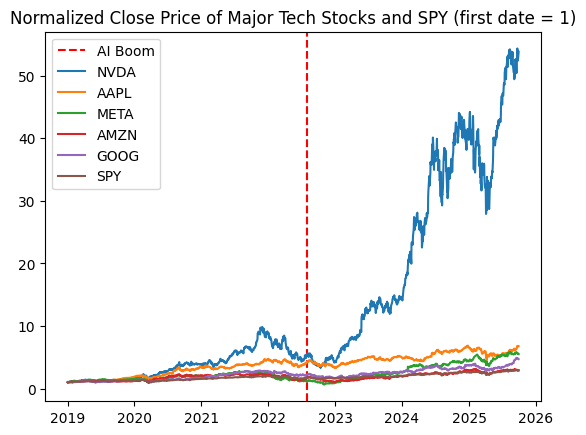
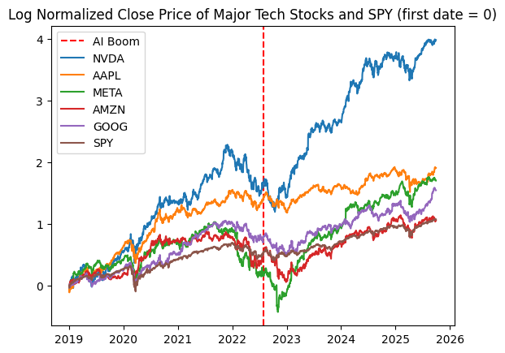
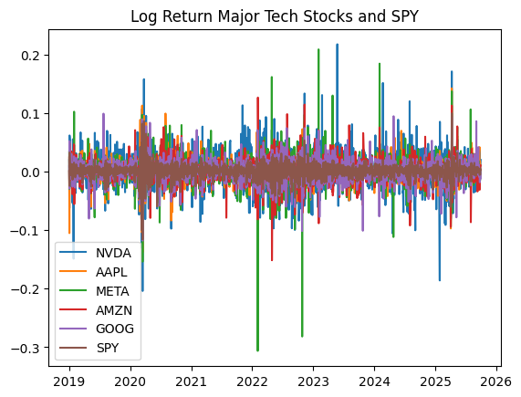
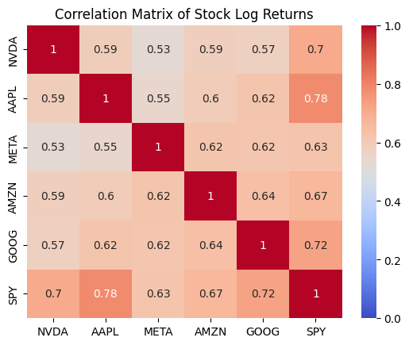
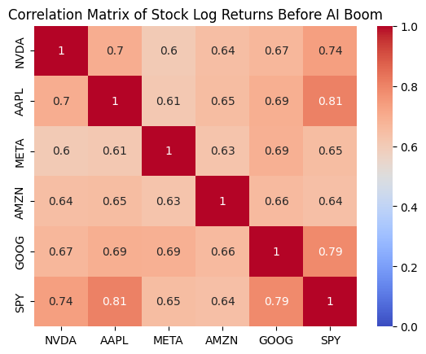
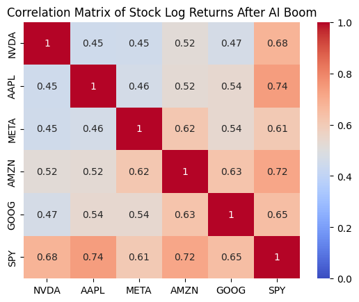
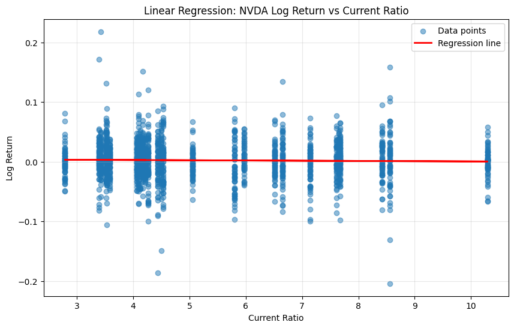

# Stock Market Analysis Report

## Data and Methodology

**Data Period**: 2019 Q1 - 2025 Q3

```python
import yfinance as yf
import numpy as np
import pandas as pd
import matplotlib.pyplot as plt
import seaborn as sns
import datetime as dt
```

## First, an investigation of stock prices
We get the close prices and volumes of each stock we are interested in. We also calculate the returns of each stock because prices are non-stationary and can rise over time even without meaningful relationships, while returns measure actual percentage changes in value. However, we want to use the the natural log of the returns to utilize some of its nice properties. For example, simple returns don't capture compounding changes well. If a stock rises 10% one day but drops 10% the next, the total isn't 0%, but actually -1%. For this case, simple returns would require multiplying, while log would just be additive.

We should also note that because SPY includes large-cap AI-related firms, correlations between individual stocks and SPY partially reflect mechanical overlap as well as broader market co-movement. But we can and should still use SPY as a benchmark.


```python
AAPL = yf.Ticker("AAPL")
META = yf.Ticker("META")
AMZN = yf.Ticker("AMZN")
NVDA = yf.Ticker("NVDA")
GOOG = yf.Ticker("GOOG")
SPY = yf.Ticker("SPY")
```


```python
def get_returns(ticker):
    start_date = "2018-12-31"
    end_date = "2025-09-30"
    returns = ticker.history(start=start_date, end=end_date)
    returns['simple_return'] = returns['Close'].pct_change()
    returns['log_return'] = np.log(returns['Close'] / returns['Close'].shift(1))
    returns = returns[['simple_return', 'log_return', 'Close', 'Volume']]
    returns.index = returns.index.date
    returns = returns.iloc[1:]
    return returns

AAPL_returns = get_returns(AAPL)
META_returns = get_returns(META)
AMZN_returns = get_returns(AMZN)
NVDA_returns = get_returns(NVDA)
GOOG_returns = get_returns(GOOG)
SPY_returns = get_returns(SPY)
```


```python
AAPL_returns
```


<div>
<style scoped>
    .dataframe tbody tr th:only-of-type {
        vertical-align: middle;
    }

    .dataframe tbody tr th {
        vertical-align: top;
    }

    .dataframe thead th {
        text-align: right;
    }
</style>
<table border="1" class="dataframe">
  <thead>
    <tr style="text-align: right;">
      <th></th>
      <th>simple_return</th>
      <th>log_return</th>
      <th>Close</th>
      <th>Volume</th>
    </tr>
  </thead>
  <tbody>
    <tr>
      <th>2019-01-02</th>
      <td>0.001141</td>
      <td>0.001140</td>
      <td>37.538822</td>
      <td>148158800</td>
    </tr>
    <tr>
      <th>2019-01-03</th>
      <td>-0.099607</td>
      <td>-0.104924</td>
      <td>33.799679</td>
      <td>365248800</td>
    </tr>
    <tr>
      <th>2019-01-04</th>
      <td>0.042689</td>
      <td>0.041803</td>
      <td>35.242558</td>
      <td>234428400</td>
    </tr>
    <tr>
      <th>2019-01-07</th>
      <td>-0.002226</td>
      <td>-0.002228</td>
      <td>35.164112</td>
      <td>219111200</td>
    </tr>
    <tr>
      <th>2019-01-08</th>
      <td>0.019063</td>
      <td>0.018884</td>
      <td>35.834446</td>
      <td>164101200</td>
    </tr>
    <tr>
      <th>...</th>
      <td>...</td>
      <td>...</td>
      <td>...</td>
      <td>...</td>
    </tr>
    <tr>
      <th>2025-09-23</th>
      <td>-0.006443</td>
      <td>-0.006464</td>
      <td>254.183594</td>
      <td>60275200</td>
    </tr>
    <tr>
      <th>2025-09-24</th>
      <td>-0.008332</td>
      <td>-0.008367</td>
      <td>252.065643</td>
      <td>42303700</td>
    </tr>
    <tr>
      <th>2025-09-25</th>
      <td>0.018073</td>
      <td>0.017912</td>
      <td>256.621216</td>
      <td>55202100</td>
    </tr>
    <tr>
      <th>2025-09-26</th>
      <td>-0.005489</td>
      <td>-0.005504</td>
      <td>255.212601</td>
      <td>46076300</td>
    </tr>
    <tr>
      <th>2025-09-29</th>
      <td>-0.004032</td>
      <td>-0.004040</td>
      <td>254.183594</td>
      <td>40127700</td>
    </tr>
  </tbody>
</table>
<p>1695 rows × 4 columns</p>
</div>


```python
returns_data = {
    'NVDA': NVDA_returns,
    'AAPL': AAPL_returns,
    'META': META_returns,
    'AMZN': AMZN_returns,
    'GOOG': GOOG_returns,
    'SPY': SPY_returns
}

AIboom_cutoff = dt.date(2022, 8, 1)

returns_data_befAI = {
    'NVDA': NVDA_returns[NVDA_returns.index < AIboom_cutoff],
    'AAPL': AAPL_returns[AAPL_returns.index < AIboom_cutoff],
    'META': META_returns[META_returns.index < AIboom_cutoff],
    'AMZN': AMZN_returns[AMZN_returns.index < AIboom_cutoff],
    'GOOG': GOOG_returns[GOOG_returns.index < AIboom_cutoff],
    'SPY': SPY_returns[SPY_returns.index < AIboom_cutoff]
}

returns_data_aftAI = {
    'NVDA': NVDA_returns[NVDA_returns.index >= AIboom_cutoff],
    'AAPL': AAPL_returns[AAPL_returns.index >= AIboom_cutoff],
    'META': META_returns[META_returns.index >= AIboom_cutoff],
    'AMZN': AMZN_returns[AMZN_returns.index >= AIboom_cutoff],
    'GOOG': GOOG_returns[GOOG_returns.index >= AIboom_cutoff],
    'SPY': SPY_returns[SPY_returns.index >= AIboom_cutoff]
}
```


```python
def plot_close_price_normalized(ticker_returns):
    plt.title(f'Normalized Close Price of Major Tech Stocks and SPY (first date = 1)')
    plt.axvline(x=AIboom_cutoff, color='red', linestyle='--', label='AI Boom')
    for name, returns_df in ticker_returns.items():
        normalized_close = returns_df['Close'] / returns_df['Close'].iloc[0]
        normalized_close.plot(label=name)
    plt.legend()
    plt.show()

plot_close_price_normalized(returns_data)

```

    c:\Users\danie\miniforge3\Lib\site-packages\pandas\plotting\_matplotlib\core.py:981: UserWarning: This axis already has a converter set and is updating to a potentially incompatible converter
      return ax.plot(*args, **kwds)
    


    

    


Because NVDA dominates this graph we will get the log to get a better look


```python
def log_plot_close_price_normalized(ticker_returns):
    plt.title('Log Normalized Close Price of Major Tech Stocks and SPY (first date = 0)')
    plt.axvline(x=AIboom_cutoff, color='red', linestyle='--', label='AI Boom')
    for name, returns_df in ticker_returns.items():
        normalized_close = np.log(returns_df['Close'] / returns_df['Close'].iloc[0])
        normalized_close.plot(label=name)
    plt.legend()
    plt.show()

log_plot_close_price_normalized(returns_data)
```

    c:\Users\danie\miniforge3\Lib\site-packages\pandas\plotting\_matplotlib\core.py:981: UserWarning: This axis already has a converter set and is updating to a potentially incompatible converter
      return ax.plot(*args, **kwds)
    


    

    


```python
def plot_log_returns(ticker_returns):
    plt.title(f'Log Return Major Tech Stocks and SPY')
    for name, returns_df in ticker_returns.items():
        returns_df['log_return'].plot(label=name)
    plt.legend()
    plt.show()

plot_log_returns(returns_data)
```


    

    


```python
def plot_correlation_matrix(ticker_returns, metric='log_return', title='Correlation Matrix of Stock Log Returns'):
    returns_data = {}
    for name, returns_df in ticker_returns.items():
        returns_data[name] = returns_df[metric]
    
    combined_returns = pd.DataFrame(returns_data).corr()
    sns.heatmap(combined_returns, annot=True, cmap='coolwarm', vmin=0, vmax=1)
    if title:
        plt.title(f"{title}")
    plt.show()

plot_correlation_matrix(returns_data)

```


    

    


```python
plot_correlation_matrix(returns_data_befAI, title='Correlation Matrix of Stock Log Returns Before AI Boom')
```


    

    


```python
plot_correlation_matrix(returns_data_aftAI, title='Correlation Matrix of Stock Log Returns After AI Boom')
```


    

    


```python
data = {
    "Quarter": [
        "2025Q3","2025Q2","2025Q1","2024Q4","2024Q3","2024Q2","2024Q1",
        "2023Q4","2023Q3","2023Q2","2023Q1",
        "2022Q4","2022Q3","2022Q2","2022Q1",
        "2021Q4","2021Q3","2021Q2","2021Q1",
        "2020Q4","2020Q3","2020Q2","2020Q1",
        "2019Q4","2019Q3","2019Q2","2019Q1",
        "2018Q4","2018Q3","2018Q2","2018Q1",
        "2017Q4","2017Q3","2017Q2","2017Q1",
        "2016Q4","2016Q3","2016Q2","2016Q1",
        "2015Q4","2015Q3","2015Q2","2015Q1"
    ],
    "Total_Current_Assets": [
        102219, 89935, 80126, 67040, 59633, 53729, 44345,
        32658, 28797, 24883, 23073,
        28829, 25806, 25806, 18127,
        16055, 15161, 14393, 14681,
        19584, 13690, 12420, 11391,
        10629,10557,11386,10347,
        11386,10831,9448,9255,
        8479,8070,8116,8536,
        8307,6156,5790,6053,
        5713,5792,5832,5731
    ],
    "Total_Current_Liabilities": [
        24257,26542,18047,16479,13969,15223,10631,
        9101,10334,7260,6563,
        4335,3612,4448,4004,
        3925,3669,2410,1930,
        1903,1784,1475,1331,
        1389,1622,2252,2300,
        1608,1462,1106,1153,
        1032,983,823,1788,
        2041,2407,2377,2351,
        1488,1495,1459,1487
    ]
}

assets_liabilities = pd.DataFrame(data).set_index("Quarter")
assets_liabilities['Current_Ratio'] = assets_liabilities['Total_Current_Assets'] / assets_liabilities['Total_Current_Liabilities']
# Change Quarter to DatetimeIndex
quarter_to_date = {
    "2025Q3": "2025-09-30","2025Q2": "2025-06-30","2025Q1": "2025-03-31","2024Q4": "2024-12-31","2024Q3": "2024-09-30","2024Q2": "2024-06-30","2024Q1": "2024-03-31",
    "2023Q4": "2023-12-31","2023Q3": "2023-09-30","2023Q2": "2023-06-30","2023Q1": "2023-03-31",
    "2022Q4": "2022-12-31","2022Q3": "2022-09-30","2022Q2": "2022-06-30","2022Q1": "2022-03-31",
    "2021Q4": "2021-12-31","2021Q3": "2021-09-30","2021Q2": "2021-06-30","2021Q1": "2021-03-31",
    "2020Q4": "2020-12-31","2020Q3": "2020-09-30","2020Q2": "2020-06-30","2020Q1": "2020-03-31",
    "2019Q4": "2019-12-31","2019Q3": "2019-09-30","2019Q2": "2019-06-30","2019Q1": "2019-03-31",
    "2018Q4": "2018-12-31","2018Q3": "2018-09-30","2018Q2": "2018-06-30","2018Q1": "2018-03-31",
    "2017Q4": "2017-12-31","2017Q3": "2017-09-30","2017Q2": "2017-06-30","2017Q1": "2017-03-31",
    "2016Q4": "2016-12-31","2016Q3": "2016-09-30","2016Q2": "2016-06-30","2016Q1": "2016-03-31",
    "2015Q4": "2015-12-31","2015Q3": "2015-09-30","2015Q2": "2015-06-30","2015Q1": "2015-03-31"
}

assets_liabilities.index = pd.to_datetime(assets_liabilities.index.map(quarter_to_date))
assets_liabilities.reset_index(inplace=True)
# Rename Quarter to Date
assets_liabilities.rename(columns={"Quarter": "Date"}, inplace=True)
assets_liabilities = assets_liabilities.set_index("Date")
assets_liabilities
```


<div>
<style scoped>
    .dataframe tbody tr th:only-of-type {
        vertical-align: middle;
    }

    .dataframe tbody tr th {
        vertical-align: top;
    }

    .dataframe thead th {
        text-align: right;
    }
</style>
<table border="1" class="dataframe">
  <thead>
    <tr style="text-align: right;">
      <th></th>
      <th>Total_Current_Assets</th>
      <th>Total_Current_Liabilities</th>
      <th>Current_Ratio</th>
    </tr>
    <tr>
      <th>Date</th>
      <th></th>
      <th></th>
      <th></th>
    </tr>
  </thead>
  <tbody>
    <tr>
      <th>2025-09-30</th>
      <td>102219</td>
      <td>24257</td>
      <td>4.214000</td>
    </tr>
    <tr>
      <th>2025-06-30</th>
      <td>89935</td>
      <td>26542</td>
      <td>3.388403</td>
    </tr>
    <tr>
      <th>2025-03-31</th>
      <td>80126</td>
      <td>18047</td>
      <td>4.439851</td>
    </tr>
    <tr>
      <th>2024-12-31</th>
      <td>67040</td>
      <td>16479</td>
      <td>4.068208</td>
    </tr>
    <tr>
      <th>2024-09-30</th>
      <td>59633</td>
      <td>13969</td>
      <td>4.268953</td>
    </tr>
    <tr>
      <th>2024-06-30</th>
      <td>53729</td>
      <td>15223</td>
      <td>3.529462</td>
    </tr>
    <tr>
      <th>2024-03-31</th>
      <td>44345</td>
      <td>10631</td>
      <td>4.171292</td>
    </tr>
    <tr>
      <th>2023-12-31</th>
      <td>32658</td>
      <td>9101</td>
      <td>3.588397</td>
    </tr>
    <tr>
      <th>2023-09-30</th>
      <td>28797</td>
      <td>10334</td>
      <td>2.786627</td>
    </tr>
    <tr>
      <th>2023-06-30</th>
      <td>24883</td>
      <td>7260</td>
      <td>3.427410</td>
    </tr>
    <tr>
      <th>2023-03-31</th>
      <td>23073</td>
      <td>6563</td>
      <td>3.515618</td>
    </tr>
    <tr>
      <th>2022-12-31</th>
      <td>28829</td>
      <td>4335</td>
      <td>6.650288</td>
    </tr>
    <tr>
      <th>2022-09-30</th>
      <td>25806</td>
      <td>3612</td>
      <td>7.144518</td>
    </tr>
    <tr>
      <th>2022-06-30</th>
      <td>25806</td>
      <td>4448</td>
      <td>5.801709</td>
    </tr>
    <tr>
      <th>2022-03-31</th>
      <td>18127</td>
      <td>4004</td>
      <td>4.527223</td>
    </tr>
    <tr>
      <th>2021-12-31</th>
      <td>16055</td>
      <td>3925</td>
      <td>4.090446</td>
    </tr>
    <tr>
      <th>2021-09-30</th>
      <td>15161</td>
      <td>3669</td>
      <td>4.132189</td>
    </tr>
    <tr>
      <th>2021-06-30</th>
      <td>14393</td>
      <td>2410</td>
      <td>5.972199</td>
    </tr>
    <tr>
      <th>2021-03-31</th>
      <td>14681</td>
      <td>1930</td>
      <td>7.606736</td>
    </tr>
    <tr>
      <th>2020-12-31</th>
      <td>19584</td>
      <td>1903</td>
      <td>10.291119</td>
    </tr>
    <tr>
      <th>2020-09-30</th>
      <td>13690</td>
      <td>1784</td>
      <td>7.673767</td>
    </tr>
    <tr>
      <th>2020-06-30</th>
      <td>12420</td>
      <td>1475</td>
      <td>8.420339</td>
    </tr>
    <tr>
      <th>2020-03-31</th>
      <td>11391</td>
      <td>1331</td>
      <td>8.558227</td>
    </tr>
    <tr>
      <th>2019-12-31</th>
      <td>10629</td>
      <td>1389</td>
      <td>7.652268</td>
    </tr>
    <tr>
      <th>2019-09-30</th>
      <td>10557</td>
      <td>1622</td>
      <td>6.508631</td>
    </tr>
    <tr>
      <th>2019-06-30</th>
      <td>11386</td>
      <td>2252</td>
      <td>5.055950</td>
    </tr>
    <tr>
      <th>2019-03-31</th>
      <td>10347</td>
      <td>2300</td>
      <td>4.498696</td>
    </tr>
    <tr>
      <th>2018-12-31</th>
      <td>11386</td>
      <td>1608</td>
      <td>7.080846</td>
    </tr>
    <tr>
      <th>2018-09-30</th>
      <td>10831</td>
      <td>1462</td>
      <td>7.408345</td>
    </tr>
    <tr>
      <th>2018-06-30</th>
      <td>9448</td>
      <td>1106</td>
      <td>8.542495</td>
    </tr>
    <tr>
      <th>2018-03-31</th>
      <td>9255</td>
      <td>1153</td>
      <td>8.026886</td>
    </tr>
    <tr>
      <th>2017-12-31</th>
      <td>8479</td>
      <td>1032</td>
      <td>8.216085</td>
    </tr>
    <tr>
      <th>2017-09-30</th>
      <td>8070</td>
      <td>983</td>
      <td>8.209563</td>
    </tr>
    <tr>
      <th>2017-06-30</th>
      <td>8116</td>
      <td>823</td>
      <td>9.861482</td>
    </tr>
    <tr>
      <th>2017-03-31</th>
      <td>8536</td>
      <td>1788</td>
      <td>4.774049</td>
    </tr>
    <tr>
      <th>2016-12-31</th>
      <td>8307</td>
      <td>2041</td>
      <td>4.070064</td>
    </tr>
    <tr>
      <th>2016-09-30</th>
      <td>6156</td>
      <td>2407</td>
      <td>2.557541</td>
    </tr>
    <tr>
      <th>2016-06-30</th>
      <td>5790</td>
      <td>2377</td>
      <td>2.435844</td>
    </tr>
    <tr>
      <th>2016-03-31</th>
      <td>6053</td>
      <td>2351</td>
      <td>2.574649</td>
    </tr>
    <tr>
      <th>2015-12-31</th>
      <td>5713</td>
      <td>1488</td>
      <td>3.839382</td>
    </tr>
    <tr>
      <th>2015-09-30</th>
      <td>5792</td>
      <td>1495</td>
      <td>3.874247</td>
    </tr>
    <tr>
      <th>2015-06-30</th>
      <td>5832</td>
      <td>1459</td>
      <td>3.997258</td>
    </tr>
    <tr>
      <th>2015-03-31</th>
      <td>5731</td>
      <td>1487</td>
      <td>3.854069</td>
    </tr>
  </tbody>
</table>
</div>


```python
# Resample by daily frequency (fill quarterly values across days)
assets_liabilities_daily = assets_liabilities.resample('D').ffill()

# Alternatively, if you want to align with your stock data date range:
start_date = "2019-01-01"
end_date = "2025-09-30"
date_range = pd.date_range(start=start_date, end=end_date, freq='D')

# Reindex to specific date range and forward fill
assets_liabilities_daily = assets_liabilities.reindex(date_range, method='ffill')

# Filter out weekends (Saturday=5, Sunday=6)
assets_liabilities_weekdays = assets_liabilities_daily[assets_liabilities_daily.index.weekday < 5]

# Alternatively, you can use business day frequency from the start
start_date = "2019-01-01"
end_date = "2025-09-30"
business_days = pd.bdate_range(start=start_date, end=end_date)

# Reindex to business days only and forward fill
assets_liabilities_business = assets_liabilities.reindex(business_days, method='ffill')

assets_liabilities_business

```


<div>
<style scoped>
    .dataframe tbody tr th:only-of-type {
        vertical-align: middle;
    }

    .dataframe tbody tr th {
        vertical-align: top;
    }

    .dataframe thead th {
        text-align: right;
    }
</style>
<table border="1" class="dataframe">
  <thead>
    <tr style="text-align: right;">
      <th></th>
      <th>Total_Current_Assets</th>
      <th>Total_Current_Liabilities</th>
      <th>Current_Ratio</th>
    </tr>
  </thead>
  <tbody>
    <tr>
      <th>2019-01-01</th>
      <td>10347</td>
      <td>2300</td>
      <td>4.498696</td>
    </tr>
    <tr>
      <th>2019-01-02</th>
      <td>10347</td>
      <td>2300</td>
      <td>4.498696</td>
    </tr>
    <tr>
      <th>2019-01-03</th>
      <td>10347</td>
      <td>2300</td>
      <td>4.498696</td>
    </tr>
    <tr>
      <th>2019-01-04</th>
      <td>10347</td>
      <td>2300</td>
      <td>4.498696</td>
    </tr>
    <tr>
      <th>2019-01-07</th>
      <td>10347</td>
      <td>2300</td>
      <td>4.498696</td>
    </tr>
    <tr>
      <th>...</th>
      <td>...</td>
      <td>...</td>
      <td>...</td>
    </tr>
    <tr>
      <th>2025-09-24</th>
      <td>102219</td>
      <td>24257</td>
      <td>4.214000</td>
    </tr>
    <tr>
      <th>2025-09-25</th>
      <td>102219</td>
      <td>24257</td>
      <td>4.214000</td>
    </tr>
    <tr>
      <th>2025-09-26</th>
      <td>102219</td>
      <td>24257</td>
      <td>4.214000</td>
    </tr>
    <tr>
      <th>2025-09-29</th>
      <td>102219</td>
      <td>24257</td>
      <td>4.214000</td>
    </tr>
    <tr>
      <th>2025-09-30</th>
      <td>102219</td>
      <td>24257</td>
      <td>4.214000</td>
    </tr>
  </tbody>
</table>
<p>1761 rows × 3 columns</p>
</div>


```python
# # Ensure both DataFrames have timezone-naive datetime indices
# if NVDA_returns.index.tz is not None:
#     NVDA_returns.index = NVDA_returns.index.tz_localize(None)

if assets_liabilities_business.index.tz is not None:
    assets_liabilities_business.index = assets_liabilities_business.index.tz_localize(None)

nvda_df = NVDA_returns.merge(assets_liabilities_business, left_index = True, right_index = True)

# Now merge should work
print(f"Merged dataframe shape: {nvda_df.shape}")
nvda_df.head()
nvda_df
```

    Merged dataframe shape: (1695, 7)
    


<div>
<style scoped>
    .dataframe tbody tr th:only-of-type {
        vertical-align: middle;
    }

    .dataframe tbody tr th {
        vertical-align: top;
    }

    .dataframe thead th {
        text-align: right;
    }
</style>
<table border="1" class="dataframe">
  <thead>
    <tr style="text-align: right;">
      <th></th>
      <th>simple_return</th>
      <th>log_return</th>
      <th>Close</th>
      <th>Volume</th>
      <th>Total_Current_Assets</th>
      <th>Total_Current_Liabilities</th>
      <th>Current_Ratio</th>
    </tr>
  </thead>
  <tbody>
    <tr>
      <th>2019-01-02</th>
      <td>0.020374</td>
      <td>0.020170</td>
      <td>3.377354</td>
      <td>508752000</td>
      <td>10347</td>
      <td>2300</td>
      <td>4.498696</td>
    </tr>
    <tr>
      <th>2019-01-03</th>
      <td>-0.060417</td>
      <td>-0.062319</td>
      <td>3.173305</td>
      <td>705552000</td>
      <td>10347</td>
      <td>2300</td>
      <td>4.498696</td>
    </tr>
    <tr>
      <th>2019-01-04</th>
      <td>0.064068</td>
      <td>0.062099</td>
      <td>3.376611</td>
      <td>585620000</td>
      <td>10347</td>
      <td>2300</td>
      <td>4.498696</td>
    </tr>
    <tr>
      <th>2019-01-07</th>
      <td>0.052941</td>
      <td>0.051587</td>
      <td>3.555370</td>
      <td>709160000</td>
      <td>10347</td>
      <td>2300</td>
      <td>4.498696</td>
    </tr>
    <tr>
      <th>2019-01-08</th>
      <td>-0.024895</td>
      <td>-0.025210</td>
      <td>3.466859</td>
      <td>786016000</td>
      <td>10347</td>
      <td>2300</td>
      <td>4.498696</td>
    </tr>
    <tr>
      <th>...</th>
      <td>...</td>
      <td>...</td>
      <td>...</td>
      <td>...</td>
      <td>...</td>
      <td>...</td>
      <td>...</td>
    </tr>
    <tr>
      <th>2025-09-23</th>
      <td>-0.028212</td>
      <td>-0.028618</td>
      <td>178.429993</td>
      <td>192559600</td>
      <td>102219</td>
      <td>24257</td>
      <td>4.214000</td>
    </tr>
    <tr>
      <th>2025-09-24</th>
      <td>-0.008182</td>
      <td>-0.008216</td>
      <td>176.970001</td>
      <td>143564100</td>
      <td>102219</td>
      <td>24257</td>
      <td>4.214000</td>
    </tr>
    <tr>
      <th>2025-09-25</th>
      <td>0.004068</td>
      <td>0.004060</td>
      <td>177.690002</td>
      <td>191586700</td>
      <td>102219</td>
      <td>24257</td>
      <td>4.214000</td>
    </tr>
    <tr>
      <th>2025-09-26</th>
      <td>0.002814</td>
      <td>0.002810</td>
      <td>178.190002</td>
      <td>148573700</td>
      <td>102219</td>
      <td>24257</td>
      <td>4.214000</td>
    </tr>
    <tr>
      <th>2025-09-29</th>
      <td>0.020540</td>
      <td>0.020332</td>
      <td>181.850006</td>
      <td>193063500</td>
      <td>102219</td>
      <td>24257</td>
      <td>4.214000</td>
    </tr>
  </tbody>
</table>
<p>1695 rows × 7 columns</p>
</div>


```python
# Linear Regression on log_return based on current_ratio
from sklearn.linear_model import LinearRegression
from sklearn.metrics import r2_score
import scipy.stats as stats

# Remove any NaN values
clean_data = nvda_df.dropna()

# Prepare the data
X = clean_data['Current_Ratio'].values.reshape(-1, 1)  # Independent variable
y = clean_data['log_return'].values  # Dependent variable

# Fit the linear regression model
model = LinearRegression()
model.fit(X, y)

# Make predictions
y_pred = model.predict(X)

# Calculate statistics
r2 = r2_score(y, y_pred)
correlation = clean_data['Current_Ratio'].corr(clean_data['log_return'])

# Calculate p-value for correlation
_, p_value = stats.pearsonr(clean_data['Current_Ratio'], clean_data['log_return'])

print(f"Linear Regression Results:")
print(f"Coefficient (slope): {model.coef_[0]:.6f}")
print(f"Intercept: {model.intercept_:.6f}")
print(f"R-squared: {r2:.6f}")
print(f"Correlation: {correlation:.6f}")
print(f"P-value: {p_value:.6f}")

# Plot the regression
plt.figure(figsize=(10, 6))
plt.scatter(clean_data['Current_Ratio'], clean_data['log_return'], alpha=0.5, label='Data points')
plt.plot(clean_data['Current_Ratio'], y_pred, color='red', linewidth=2, label='Regression line')
plt.xlabel('Current Ratio')
plt.ylabel('Log Return')
plt.title('Linear Regression: NVDA Log Return vs Current Ratio')
plt.legend()
plt.grid(True, alpha=0.3)
plt.show()

# Display regression equation
print(f"\nRegression equation: log_return = {model.intercept_:.6f} + {model.coef_[0]:.6f} * Current_Ratio")
```

    Linear Regression Results:
    Coefficient (slope): -0.000392
    Intercept: 0.004486
    R-squared: 0.000544
    Correlation: -0.023333
    P-value: 0.337027
    


    

    


    
    Regression equation: log_return = 0.004486 + -0.000392 * Current_Ratio
    

# Question One
How does NVIDIA’s stock returns correlate with other major technology companies (META, AMZN, AAPL, GOOG) and the S&P 500 (SPY), and how has this relationship changed before and after the AI boom? First we merge all the data to Q1_df.


```python
# Merge all ticker_return dataframes on the date index
ticker_returns_list = [
    (AAPL_returns, 'AAPL'),
    (META_returns, 'META'),
    (AMZN_returns, 'AMZN'),
    (NVDA_returns, 'NVDA'),
    (GOOG_returns, 'GOOG'),
    (SPY_returns, 'SPY')
]

# Create a list of dataframes with renamed columns
dfs_to_merge = []
for df, ticker in ticker_returns_list:
    df_copy = df.copy()
    # Rename columns to include ticker name
    df_copy.columns = [f'{ticker}_{col}' for col in df_copy.columns]
    dfs_to_merge.append(df_copy)

# Merge all dataframes on the index (date)
Q1_df = dfs_to_merge[0]
for df in dfs_to_merge[1:]:
    Q1_df = Q1_df.merge(df, left_index=True, right_index=True, how='outer')

Q1_df
```


<div>
<style scoped>
    .dataframe tbody tr th:only-of-type {
        vertical-align: middle;
    }

    .dataframe tbody tr th {
        vertical-align: top;
    }

    .dataframe thead th {
        text-align: right;
    }
</style>
<table border="1" class="dataframe">
  <thead>
    <tr style="text-align: right;">
      <th></th>
      <th>AAPL_simple_return</th>
      <th>AAPL_log_return</th>
      <th>AAPL_Close</th>
      <th>AAPL_Volume</th>
      <th>META_simple_return</th>
      <th>META_log_return</th>
      <th>META_Close</th>
      <th>META_Volume</th>
      <th>AMZN_simple_return</th>
      <th>AMZN_log_return</th>
      <th>...</th>
      <th>NVDA_Close</th>
      <th>NVDA_Volume</th>
      <th>GOOG_simple_return</th>
      <th>GOOG_log_return</th>
      <th>GOOG_Close</th>
      <th>GOOG_Volume</th>
      <th>SPY_simple_return</th>
      <th>SPY_log_return</th>
      <th>SPY_Close</th>
      <th>SPY_Volume</th>
    </tr>
  </thead>
  <tbody>
    <tr>
      <th>2019-01-02</th>
      <td>0.001141</td>
      <td>0.001140</td>
      <td>37.538822</td>
      <td>148158800</td>
      <td>0.035014</td>
      <td>0.034415</td>
      <td>134.848679</td>
      <td>28146200</td>
      <td>0.024741</td>
      <td>0.024440</td>
      <td>...</td>
      <td>3.377354</td>
      <td>508752000</td>
      <td>0.009888</td>
      <td>0.009839</td>
      <td>51.937084</td>
      <td>30652000</td>
      <td>0.001040</td>
      <td>0.001040</td>
      <td>225.660126</td>
      <td>126925200</td>
    </tr>
    <tr>
      <th>2019-01-03</th>
      <td>-0.099607</td>
      <td>-0.104924</td>
      <td>33.799679</td>
      <td>365248800</td>
      <td>-0.029039</td>
      <td>-0.029469</td>
      <td>130.932846</td>
      <td>22717900</td>
      <td>-0.025241</td>
      <td>-0.025566</td>
      <td>...</td>
      <td>3.173305</td>
      <td>705552000</td>
      <td>-0.028484</td>
      <td>-0.028898</td>
      <td>50.457703</td>
      <td>36822000</td>
      <td>-0.023863</td>
      <td>-0.024152</td>
      <td>220.275284</td>
      <td>144140700</td>
    </tr>
    <tr>
      <th>2019-01-04</th>
      <td>0.042689</td>
      <td>0.041803</td>
      <td>35.242558</td>
      <td>234428400</td>
      <td>0.047138</td>
      <td>0.046061</td>
      <td>137.104782</td>
      <td>29002100</td>
      <td>0.050064</td>
      <td>0.048851</td>
      <td>...</td>
      <td>3.376611</td>
      <td>585620000</td>
      <td>0.053786</td>
      <td>0.052390</td>
      <td>53.171631</td>
      <td>41878000</td>
      <td>0.033496</td>
      <td>0.032947</td>
      <td>227.653580</td>
      <td>142628800</td>
    </tr>
    <tr>
      <th>2019-01-07</th>
      <td>-0.002226</td>
      <td>-0.002228</td>
      <td>35.164112</td>
      <td>219111200</td>
      <td>0.000725</td>
      <td>0.000725</td>
      <td>137.204163</td>
      <td>20089300</td>
      <td>0.034353</td>
      <td>0.033777</td>
      <td>...</td>
      <td>3.555370</td>
      <td>709160000</td>
      <td>-0.002167</td>
      <td>-0.002169</td>
      <td>53.056423</td>
      <td>39638000</td>
      <td>0.007885</td>
      <td>0.007854</td>
      <td>229.448547</td>
      <td>103139100</td>
    </tr>
    <tr>
      <th>2019-01-08</th>
      <td>0.019063</td>
      <td>0.018884</td>
      <td>35.834446</td>
      <td>164101200</td>
      <td>0.032452</td>
      <td>0.031937</td>
      <td>141.656754</td>
      <td>26263800</td>
      <td>0.016612</td>
      <td>0.016476</td>
      <td>...</td>
      <td>3.466859</td>
      <td>786016000</td>
      <td>0.007385</td>
      <td>0.007358</td>
      <td>53.448238</td>
      <td>35298000</td>
      <td>0.009395</td>
      <td>0.009352</td>
      <td>231.604309</td>
      <td>102512600</td>
    </tr>
    <tr>
      <th>...</th>
      <td>...</td>
      <td>...</td>
      <td>...</td>
      <td>...</td>
      <td>...</td>
      <td>...</td>
      <td>...</td>
      <td>...</td>
      <td>...</td>
      <td>...</td>
      <td>...</td>
      <td>...</td>
      <td>...</td>
      <td>...</td>
      <td>...</td>
      <td>...</td>
      <td>...</td>
      <td>...</td>
      <td>...</td>
      <td>...</td>
      <td>...</td>
    </tr>
    <tr>
      <th>2025-09-23</th>
      <td>-0.006443</td>
      <td>-0.006464</td>
      <td>254.183594</td>
      <td>60275200</td>
      <td>-0.012755</td>
      <td>-0.012837</td>
      <td>755.400024</td>
      <td>10872600</td>
      <td>-0.030400</td>
      <td>-0.030872</td>
      <td>...</td>
      <td>178.429993</td>
      <td>192559600</td>
      <td>-0.002135</td>
      <td>-0.002138</td>
      <td>252.339996</td>
      <td>17521100</td>
      <td>-0.005444</td>
      <td>-0.005458</td>
      <td>663.210022</td>
      <td>81708900</td>
    </tr>
    <tr>
      <th>2025-09-24</th>
      <td>-0.008332</td>
      <td>-0.008367</td>
      <td>252.065643</td>
      <td>42303700</td>
      <td>0.006963</td>
      <td>0.006939</td>
      <td>760.659973</td>
      <td>8828200</td>
      <td>-0.002265</td>
      <td>-0.002268</td>
      <td>...</td>
      <td>176.970001</td>
      <td>143564100</td>
      <td>-0.017873</td>
      <td>-0.018034</td>
      <td>247.830002</td>
      <td>16958500</td>
      <td>-0.003182</td>
      <td>-0.003187</td>
      <td>661.099976</td>
      <td>68082200</td>
    </tr>
    <tr>
      <th>2025-09-25</th>
      <td>0.018073</td>
      <td>0.017912</td>
      <td>256.621216</td>
      <td>55202100</td>
      <td>-0.015447</td>
      <td>-0.015568</td>
      <td>748.909973</td>
      <td>10591100</td>
      <td>-0.009355</td>
      <td>-0.009399</td>
      <td>...</td>
      <td>177.690002</td>
      <td>191586700</td>
      <td>-0.005084</td>
      <td>-0.005097</td>
      <td>246.570007</td>
      <td>17379800</td>
      <td>-0.004614</td>
      <td>-0.004624</td>
      <td>658.049988</td>
      <td>89622100</td>
    </tr>
    <tr>
      <th>2025-09-26</th>
      <td>-0.005489</td>
      <td>-0.005504</td>
      <td>255.212601</td>
      <td>46076300</td>
      <td>-0.006890</td>
      <td>-0.006914</td>
      <td>743.750000</td>
      <td>9696300</td>
      <td>0.007472</td>
      <td>0.007444</td>
      <td>...</td>
      <td>178.190002</td>
      <td>148573700</td>
      <td>0.002474</td>
      <td>0.002471</td>
      <td>247.179993</td>
      <td>16594600</td>
      <td>0.005729</td>
      <td>0.005713</td>
      <td>661.820007</td>
      <td>69179200</td>
    </tr>
    <tr>
      <th>2025-09-29</th>
      <td>-0.004032</td>
      <td>-0.004040</td>
      <td>254.183594</td>
      <td>40127700</td>
      <td>-0.000471</td>
      <td>-0.000471</td>
      <td>743.400024</td>
      <td>9246800</td>
      <td>0.010875</td>
      <td>0.010816</td>
      <td>...</td>
      <td>181.850006</td>
      <td>193063500</td>
      <td>-0.011409</td>
      <td>-0.011474</td>
      <td>244.360001</td>
      <td>23157200</td>
      <td>0.002810</td>
      <td>0.002806</td>
      <td>663.679993</td>
      <td>73499000</td>
    </tr>
  </tbody>
</table>
<p>1695 rows × 24 columns</p>
</div>


Now we can conduct regression analysis. We would have to conduct a hypothesis test on each predictor variable vs the response variable, with the hypotheses being:  
- H0: The predictor has no linear relationship with NVDA stock returns
- H1: The predictor has a linear relationship with NVDA stock returns

We will use a significance level of 5%. Note that we are not doing a pairwise analysis so we do not need to do a bonferroni correction


```python
# Regression analysis: NVDA_log_return ~ all other tickers' log_return
import statsmodels.api as sm
from sklearn.metrics import r2_score

# Prepare the data - extract log_return columns
log_return_cols = [col for col in Q1_df.columns if 'log_return' in col]
regression_data = Q1_df[log_return_cols].copy()

# Remove any NaN values
clean_data = regression_data.dropna()

# Separate NVDA_log_return (dependent variable) from other tickers (independent variables)
y = clean_data['NVDA_log_return'].values
X_cols = [col for col in log_return_cols if col != 'NVDA_log_return']
X = clean_data[X_cols].values

# Add constant term for intercept (statsmodels requires this)
X_with_const = sm.add_constant(X)

# Fit the linear regression model using statsmodels (for p-values)
model = sm.OLS(y, X_with_const).fit()

# Get coefficients and p-values
coefficients = model.params[1:]  # Exclude intercept
p_values = model.pvalues[1:]  # Exclude intercept
intercept = model.params[0]
intercept_pvalue = model.pvalues[0]

# Create a summary dataframe with coefficients and p-values
coefficients_df = pd.DataFrame({
    'Ticker': [col.replace('_log_return', '') for col in X_cols],
    'Coefficient': coefficients,
    'P-value': p_values
})

# Calculate correlations
correlations = {}
for col in X_cols:
    correlations[col.replace('_log_return', '')] = clean_data['NVDA_log_return'].corr(clean_data[col])

# Display results
print("=" * 70)
print("REGRESSION ANALYSIS: NVDA_log_return ~ Other Tickers' log_return")
print("=" * 70)
print(f"\nIntercept: {intercept:.6f} (p-value: {intercept_pvalue:.6f})")
print(f"R-squared: {model.rsquared:.6f}")
print(f"Adjusted R-squared: {model.rsquared_adj:.6f}")
print(f"\nNumber of observations: {len(clean_data)}")
print("\n" + "-" * 70)
print("COEFFICIENTS:")
print("-" * 70)
print(f"{'Ticker':>8} {'Coefficient':>15} {'P-value':>15}")
print("-" * 70)
for i, ticker in enumerate(coefficients_df['Ticker']):
    print(f"{ticker:>8} {coefficients[i]:>15.6f} {p_values[i]:>15.6f}")
print("\n" + "-" * 70)
print("CORRELATIONS with NVDA_log_return:")
print("-" * 70)
for ticker, corr in correlations.items():
    print(f"{ticker:>8}: {corr:>15.6f}")

# Display the coefficients dataframe
print("\n" + "=" * 70)
coefficients_df

```

    ======================================================================
    REGRESSION ANALYSIS: NVDA_log_return ~ Other Tickers' log_return
    ======================================================================
    
    Intercept: 0.001165 (p-value: 0.033557)
    R-squared: 0.526087
    Adjusted R-squared: 0.524684
    
    Number of observations: 1695
    
    ----------------------------------------------------------------------
    COEFFICIENTS:
    ----------------------------------------------------------------------
      Ticker     Coefficient         P-value
    ----------------------------------------------------------------------
        AAPL        0.079366        0.078251
        META        0.090821        0.001602
        AMZN        0.242518        0.000000
        GOOG        0.080995        0.062932
         SPY        1.234093        0.000000
    
    ----------------------------------------------------------------------
    CORRELATIONS with NVDA_log_return:
    ----------------------------------------------------------------------
        AAPL:        0.587921
        META:        0.530672
        AMZN:        0.585315
        GOOG:        0.574472
         SPY:        0.704307
    
    ======================================================================
    


<div>
<style scoped>
    .dataframe tbody tr th:only-of-type {
        vertical-align: middle;
    }

    .dataframe tbody tr th {
        vertical-align: top;
    }

    .dataframe thead th {
        text-align: right;
    }
</style>
<table border="1" class="dataframe">
  <thead>
    <tr style="text-align: right;">
      <th></th>
      <th>Ticker</th>
      <th>Coefficient</th>
      <th>P-value</th>
    </tr>
  </thead>
  <tbody>
    <tr>
      <th>0</th>
      <td>AAPL</td>
      <td>0.079366</td>
      <td>7.825088e-02</td>
    </tr>
    <tr>
      <th>1</th>
      <td>META</td>
      <td>0.090821</td>
      <td>1.601734e-03</td>
    </tr>
    <tr>
      <th>2</th>
      <td>AMZN</td>
      <td>0.242518</td>
      <td>1.429427e-10</td>
    </tr>
    <tr>
      <th>3</th>
      <td>GOOG</td>
      <td>0.080995</td>
      <td>6.293174e-02</td>
    </tr>
    <tr>
      <th>4</th>
      <td>SPY</td>
      <td>1.234093</td>
      <td>3.449551e-47</td>
    </tr>
  </tbody>
</table>
</div>


We can see from here that AAPL and GOOG have a p-value >0.05 so we fail to reject the null. Our test suggests that AAPL and GOOG log returns do NOT have a significant linear relationship with NVDA log returns. It should be noted this does not necessarily mean they lack a relationship with NVIDIA. High multicollinearity among these tech stocks inflates standard errors, making it difficult to isolate each company's unique effect.

Meanwhile META, AMZN, and SPY have a p-value <0.05 so we reject the null. Our test suggests that META, AMZN and SPY log returns DO have a significant linear relationship with NVDA log returns.

## Before and After the AI boom
Now we split the Q1_df to before and after the AI boom


```python
# Regression analysis: NVDA_log_return ~ all other tickers' log_return
# WITH INTERACTION TERMS for before/after AI boom
import statsmodels.api as sm
import numpy as np

# AI boom cutoff date
AIboom_cutoff = dt.date(2022, 8, 1)

# Prepare the data - extract log_return columns
log_return_cols = [col for col in Q1_df.columns if 'log_return' in col]
regression_data = Q1_df[log_return_cols].copy()

# Remove any NaN values
clean_data = regression_data.dropna()

# Create period dummy variable: 0 = before AI boom, 1 = after AI boom
clean_data['period'] = (clean_data.index >= AIboom_cutoff).astype(int)

# Separate NVDA_log_return (dependent variable) from other tickers (independent variables)
y = clean_data['NVDA_log_return'].values
X_cols = [col for col in log_return_cols if col != 'NVDA_log_return']

# Create main effect variables (before AI boom baseline)
X_main = clean_data[X_cols].values

# Create interaction terms (ticker_return * period_dummy)
X_interactions = []
interaction_names = []
for col in X_cols:
    interaction = clean_data[col].values * clean_data['period'].values
    X_interactions.append(interaction)
    interaction_names.append(f"{col.replace('_log_return', '')}_x_Period")

# Combine main effects and interaction terms
X_combined = np.column_stack([X_main, np.column_stack(X_interactions)])

# Add constant term for intercept (statsmodels requires this)
X_with_const = sm.add_constant(X_combined)

# Fit the linear regression model using statsmodels (for p-values)
model = sm.OLS(y, X_with_const).fit()

# Get coefficients and p-values
intercept = model.params[0]
intercept_pvalue = model.pvalues[0]
main_coefficients = model.params[1:len(X_cols)+1]  # Main effects (β)
interaction_coefficients = model.params[len(X_cols)+1:]  # Interaction effects (γ)
main_pvalues = model.pvalues[1:len(X_cols)+1]
interaction_pvalues = model.pvalues[len(X_cols)+1:]

# Create summary dataframes
main_effects_df = pd.DataFrame({
    'Ticker': [col.replace('_log_return', '') for col in X_cols],
    'Coefficient (β)': main_coefficients,
    'P-value': main_pvalues
})

interaction_effects_df = pd.DataFrame({
    'Ticker': [name.replace('_x_Period', '') for name in interaction_names],
    'Coefficient (γ)': interaction_coefficients,
    'P-value': interaction_pvalues
})

# Calculate correlations
correlations = {}
for col in X_cols:
    correlations[col.replace('_log_return', '')] = clean_data['NVDA_log_return'].corr(clean_data[col])

# Display results
print("=" * 80)
print("REGRESSION ANALYSIS: NVDA_log_return ~ Other Tickers' log_return")
print("WITH INTERACTION TERMS (Before/After AI Boom)")
print("=" * 80)
print(f"\nModel: r_NVDA,t = β₀ + Σ(βᵢ·r_ticker,t) + Σ(γᵢ·r_ticker,t·period_t) + ε_t")
print(f"where period_t = 0 (before {AIboom_cutoff}), 1 (after {AIboom_cutoff})")
print(f"\nIntercept (β₀): {intercept:.6f} (p-value: {intercept_pvalue:.6f})")
print(f"R-squared: {model.rsquared:.6f}")
print(f"Adjusted R-squared: {model.rsquared_adj:.6f}")
print(f"\nNumber of observations: {len(clean_data)}")
print(f"  - Before AI boom: {(clean_data['period'] == 0).sum()}")
print(f"  - After AI boom: {(clean_data['period'] == 1).sum()}")

print("\n" + "-" * 80)
print("MAIN EFFECTS (β): Baseline relationship before AI boom")
print("-" * 80)
print(f"{'Ticker':>8} {'Coefficient (β)':>18} {'P-value':>15}")
print("-" * 80)
for i, ticker in enumerate(main_effects_df['Ticker']):
    print(f"{ticker:>8} {main_coefficients[i]:>18.6f} {main_pvalues[i]:>15.6f}")

print("\n" + "-" * 80)
print("INTERACTION EFFECTS (γ): Change in relationship after AI boom")
print("-" * 80)
print(f"{'Ticker':>8} {'Coefficient (γ)':>18} {'P-value':>15}")
print("-" * 80)
for i, ticker in enumerate(interaction_effects_df['Ticker']):
    print(f"{ticker:>8} {interaction_coefficients[i]:>18.6f} {interaction_pvalues[i]:>15.6f}")

print("\n" + "-" * 80)
print("CORRELATIONS with NVDA_log_return:")
print("-" * 80)
for ticker, corr in correlations.items():
    print(f"{ticker:>8}: {corr:>15.6f}")

# Display the coefficients dataframes
print("\n" + "=" * 80)
print("MAIN EFFECTS SUMMARY:")
main_effects_df

print("\n" + "=" * 80)
print("INTERACTION EFFECTS SUMMARY:")
interaction_effects_df
```

    ================================================================================
    REGRESSION ANALYSIS: NVDA_log_return ~ Other Tickers' log_return
    WITH INTERACTION TERMS (Before/After AI Boom)
    ================================================================================
    
    Model: r_NVDA,t = β₀ + Σ(βᵢ·r_ticker,t) + Σ(γᵢ·r_ticker,t·period_t) + ε_t
    where period_t = 0 (before 2022-08-01), 1 (after 2022-08-01)
    
    Intercept (β₀): 0.001002 (p-value: 0.063210)
    R-squared: 0.544088
    Adjusted R-squared: 0.541381
    
    Number of observations: 1695
      - Before AI boom: 901
      - After AI boom: 794
    
    --------------------------------------------------------------------------------
    MAIN EFFECTS (β): Baseline relationship before AI boom
    --------------------------------------------------------------------------------
      Ticker    Coefficient (β)         P-value
    --------------------------------------------------------------------------------
        AAPL           0.275114        0.000006
        META           0.105411        0.009692
        AMZN           0.295748        0.000000
        GOOG           0.147655        0.028161
         SPY           0.764666        0.000000
    
    --------------------------------------------------------------------------------
    INTERACTION EFFECTS (γ): Change in relationship after AI boom
    --------------------------------------------------------------------------------
      Ticker    Coefficient (γ)         P-value
    --------------------------------------------------------------------------------
        AAPL          -0.502651        0.000000
        META          -0.048675        0.391777
        AMZN          -0.247926        0.001182
        GOOG          -0.074772        0.392089
         SPY           1.359126        0.000000
    
    --------------------------------------------------------------------------------
    CORRELATIONS with NVDA_log_return:
    --------------------------------------------------------------------------------
        AAPL:        0.587921
        META:        0.530672
        AMZN:        0.585315
        GOOG:        0.574472
         SPY:        0.704307
    
    ================================================================================
    MAIN EFFECTS SUMMARY:
    
    ================================================================================
    INTERACTION EFFECTS SUMMARY:
    


<div>
<style scoped>
    .dataframe tbody tr th:only-of-type {
        vertical-align: middle;
    }

    .dataframe tbody tr th {
        vertical-align: top;
    }

    .dataframe thead th {
        text-align: right;
    }
</style>
<table border="1" class="dataframe">
  <thead>
    <tr style="text-align: right;">
      <th></th>
      <th>Ticker</th>
      <th>Coefficient (γ)</th>
      <th>P-value</th>
    </tr>
  </thead>
  <tbody>
    <tr>
      <th>0</th>
      <td>AAPL</td>
      <td>-0.502651</td>
      <td>2.955777e-08</td>
    </tr>
    <tr>
      <th>1</th>
      <td>META</td>
      <td>-0.048675</td>
      <td>3.917768e-01</td>
    </tr>
    <tr>
      <th>2</th>
      <td>AMZN</td>
      <td>-0.247926</td>
      <td>1.182498e-03</td>
    </tr>
    <tr>
      <th>3</th>
      <td>GOOG</td>
      <td>-0.074772</td>
      <td>3.920888e-01</td>
    </tr>
    <tr>
      <th>4</th>
      <td>SPY</td>
      <td>1.359126</td>
      <td>1.484409e-14</td>
    </tr>
  </tbody>
</table>
</div>


```python

```
